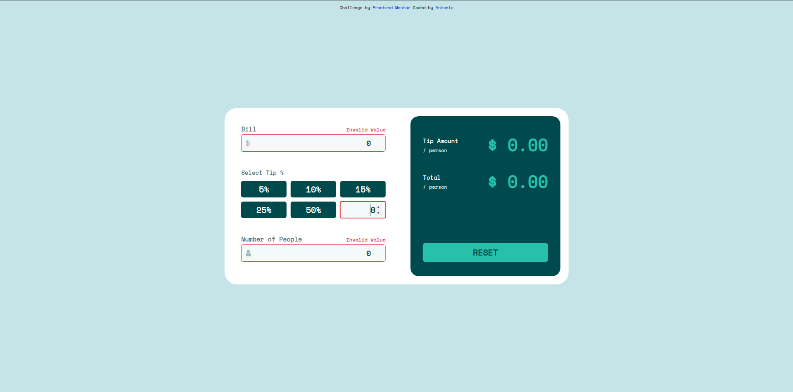

# Frontend Mentor - Tip calculator app solution

This is a solution to the [Tip calculator app challenge on Frontend Mentor](https://www.frontendmentor.io/challenges/tip-calculator-app-ugJNGbJUX). Frontend Mentor challenges help you improve your coding skills by building realistic projects.

## Table of contents

- [Overview](#overview)
  - [The challenge](#the-challenge)
  - [Screenshots](#screenshots)
  - [Links](#links)
- [My process](#our-process)
  - [Built with](#built-with)
  - [What I learned](#what-we-learned)
  - [Continued development](#continued-development)
  - [Useful resources](#useful-resources)
- [Author](#author)
- [Acknowledgments](#acknowledgments)

## Overview

### The challenge

Users should be able to:

- View the optimal layout for the app depending on their device's screen size
- See hover states for all interactive elements on the page
- Calculate the correct tip and total cost of the bill per person

### Screenshots

### Links

- Solution URL: [https://www.frontendmentor.io/challenges/tip-calculator-app-ugJNGbJUX/hub/pure-html-css-and-js-es6-y_xUuC9wB](https://www.frontendmentor.io/challenges/tip-calculator-app-ugJNGbJUX/hub/pure-html-css-and-js-es6-y_xUuC9wB)
- Live Site URL: [https://antoni0o-tip-calculator.netlify.app/](https://antoni0o-tip-calculator.netlify.app/)

## My process

### Built with

- HTML5
- CSS3
- JavaScript - ES6

### What I learned
I've learned more about DOM, and how to connect HTML to JS in various methods.

### Useful resources

- [MDN](https://developer.mozilla.org/) - This is an amazing website which helped me to understand more about HTML, CSS and JavaScript tricks. I recommend it to anyone still learning these concepts.

## Author

- Frontend Mentor - [@Antoni0o](https://www.frontendmentor.io/profile/Antoni0o)
- GitHub - [@Antoni0o](https://github.com/Antoni0o)

## Acknowledgments
In this challenge I learned a lot, but the most important for me was the capacity to find solutions of the problems found in development.

